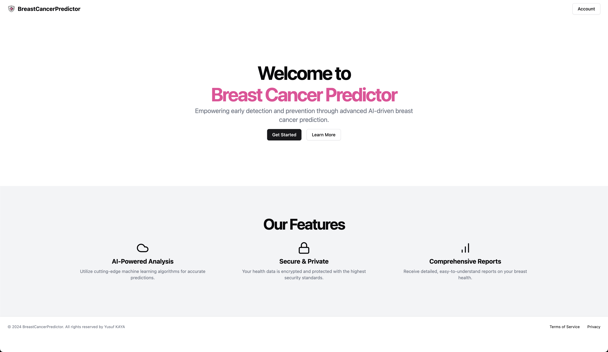
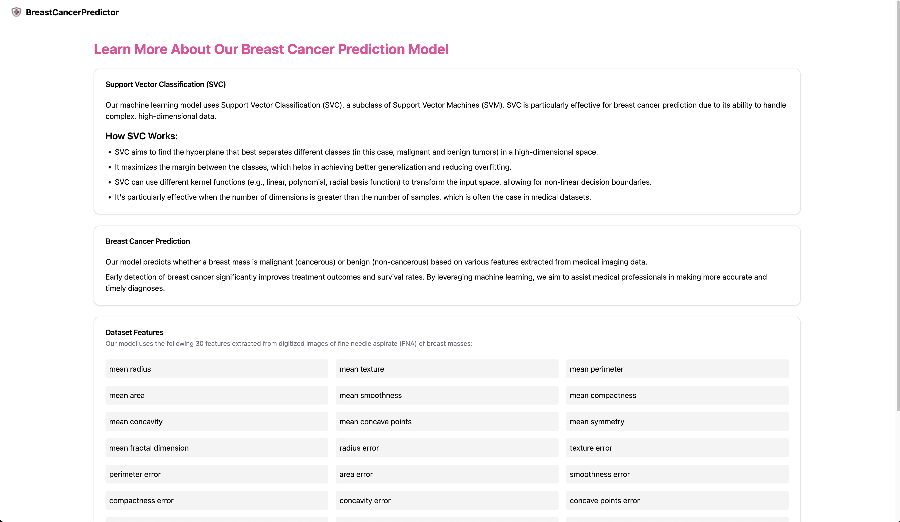
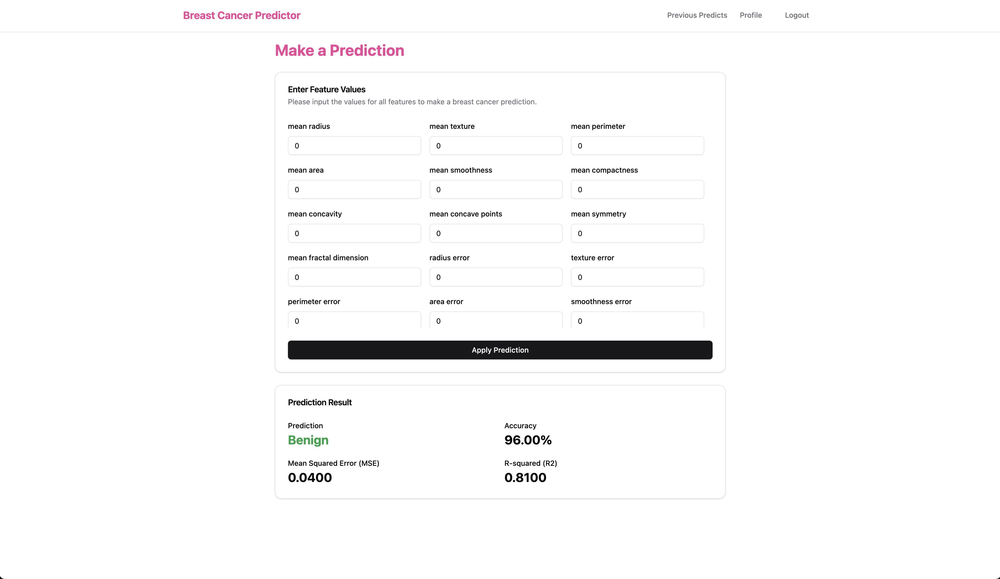
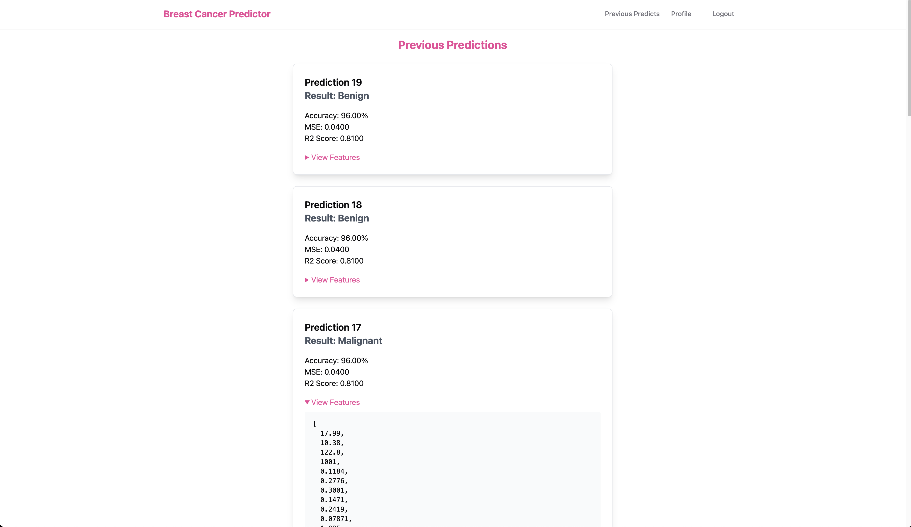
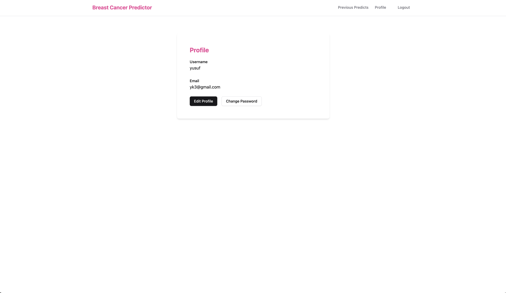

# **Breast Cancer Predictor**

**Breast Cancer Predictor** is an application that combines **Machine Learning** and **Web Development** technologies. The project focuses on detecting breast cancer using **Support Vector Machines (SVM)**.

🔗 **Live Demo**: [https://breastcancerpredictor.vercel.app/](https://breastcancerpredictor.vercel.app/)

---

## **Project Overview**

- **Goal**: To predict whether breast cancer tumors are benign or malignant.
- **Machine Learning**:  
  - **Dataset**: Sklearn Breast Cancer Dataset.  
  - **Model**: SVC (Support Vector Classifier) with an linear kernel.  
- **Technologies Used**:  
  - **Backend**: Flask API and ASP.NET Core API.  
  - **Frontend**: React (TypeScript) + TailwindCSS.  
  - **Database**: PostgreSQL.  
  - **Docker**: Used to containerize all components.  

---

## **Technologies**

### **Machine Learning**
- **Dataset**: Sklearn Breast Cancer Dataset.  
- **Libraries**:  
  - Scikit-learn (SVC model).  
  - Flask (API).  
  - Pandas, NumPy.  
  - Joblib (Model saving/loading).  

### **Backend (ASP.NET Core)**
- **JWT Authentication**: Ensures secure access to API endpoints.  
- **Layered Architecture**:  
  - Controller → Service → Repository.  
- **Database**: PostgreSQL.  

### **Frontend (React)**
- **Tech Stack**: React + TypeScript + Vite.  
- **Styling**: TailwindCSS.  
- **Pre-Built Components**: Shadcn/UI.  

### **Docker**
- Docker Compose orchestrates all services (Flask API, .NET API, PostgreSQL) as containers.  

---

## **Project Features**

1. **Prediction API**:  
   - A `/predict` endpoint exposed via Flask.  
   - Accepts 30 features to predict tumor type (Benign or Malignant).
   - Previous predicts for users. 
2. **Secure JWT Authentication**:  
   - Ensures secure user authentication and authorization.
   - Hashed password and encrypted email for database. 
3. **User-Friendly React Interface**:  
   - Clean and modern UI design.  
4. **CI/CD Deployment**:  
   - Deployed using Vercel with GitHub Actions.  

---

## **Installation**

### Clone the repository:

```bash
git clone https://github.com/ykdid/BreastCancerPredictor.git  
cd BreastCancerPredictor
```

### Start with Docker:

```bash
docker compose up --build  
```

### Frontend Setup:

```bash
cd react-ts-vite  
pnpm install  
pnpm run dev  
```

---

## **Screenshots**

### Homepage  


### Learn More Page  
  

### Make Predict Page   


### Previous Predicts Page   


### Profile Page   


---

## **Live Demo**

[https://breastcancerpredictor.vercel.app/](https://breastcancerpredictor.vercel.app/)

---

## **Author**

**Yusuf Kaya**  
📧 Email: [yusufkaya.yjk@gmail.com](mailto:yusufkaya.yjk@gmail.com)  

